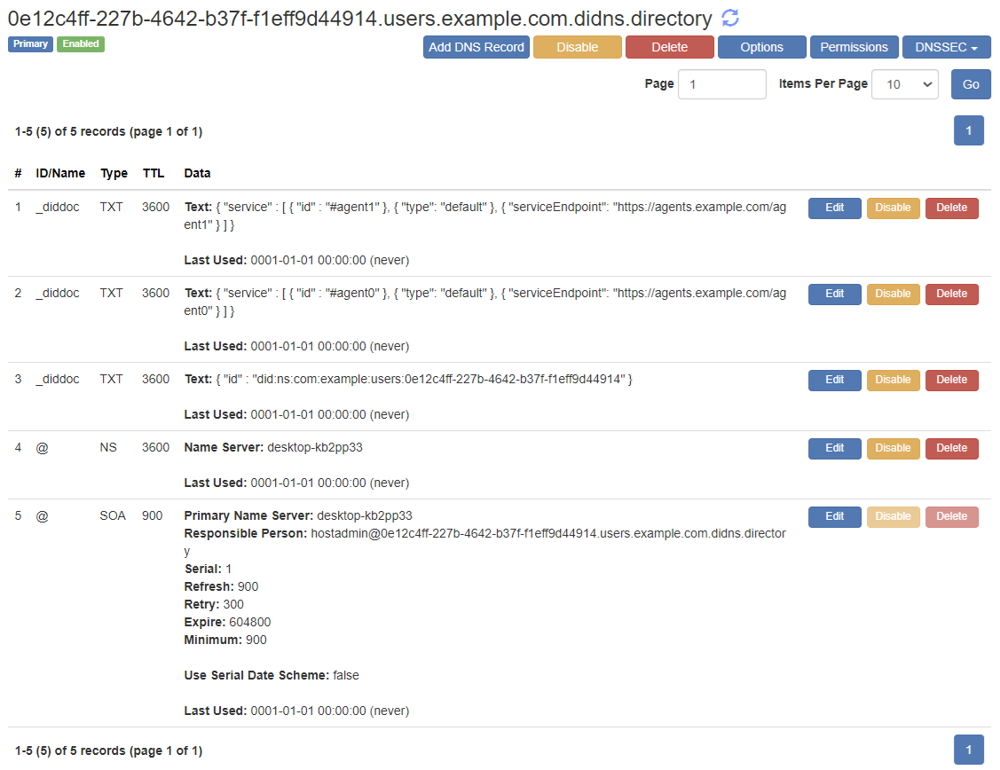
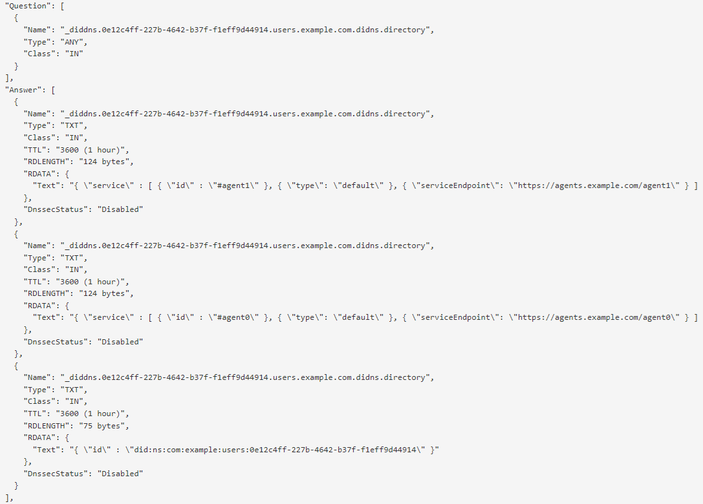

# Web 7.0 Ultraweb Decentralized Identifier Name System (DIDNS) DID Method Specification version 1.0.1

## 1. Context

### Purpose

The purpose of a DID Method Specification is to define the following:
- DID Identifier Syntax and Construction
- DID Identifier Query Operators
- DID Document CRUD Abstract Interface(s)
- DID Method Platform Implementation Guidance

The Web 7.0 Decentralized Identifier Name System (DIDNS) DID Method Specification (DIDNS DID Method Specification) 
defines the end-to-end lifecycle of DID Identifiers and DID Documents for use in the Web 7.0 Ultraweb ecosystem.

Web 7.0 is a secure, message-based, decentralized operating system that underpins a unified software and hardware ecosystem for building resilient, trusted, decentralized systems using decentralized identifiers, DIDComm agents, and verifiable credentials.

The Web 7.0 Foundation, a federally-incorporated Canadian non-profit organization, is chartered to support, promote, protect, and curate the Web 7.0 ecosystem: operating system software, standards, and specifications; as well as other software and technology projects.

This specification defines the following:
- DIDNS Identifier Syntax and Construction
- DIDNS Identifier DID Document CRUD Abstract Interface

This specification also provides Platform Implementation Guidance to assist Implementors in creating safe and secure Web 7.0 apps, agents, services and platforms that are compliant with the DIDNS DID Method Specification.

### Out-of-Scope

The following topics are out-of-scope:
- Descriptions of any implementation-specific design, implementation, or deployment details for any particular software platform that might support the DIDNS DID Method Namespace.

### Intended Audience

The primary audience for this DID Method Specification is Implementors of Web 7.0 apps, DIDComm agents, and services; including but not limited to: 
software architects, data modelers, application developers, services developers, testers, operators, and user experience (UX) specialists. 
In addition, other people involved in a broad range of standards efforts related to decentralized identity,
verifiable credentials, and secure storage may also be interested in reading this specification.

### Terminology

- The term DIDNS Identifier is synonymous with the term DIDNS Decentralized Identifier. 
- The term DIDNS Identifier DID Document is synonymous with the term DIDNS Decentralized Identifier Document.
- The term DIDNS DID Method Specification is synonymous with the term DIDNS Decentralized Identifier Name System (DIDNS) DID Method Specification..
- A compliant DIDNS runtime library is a software library that, in part, implements the DIDNS Identifier DID Document CRUD Abstract Interface in a way that complies with the DIDNS DID Method Specification.

### Conformance

This specification conforms to the requirements specified in the 
Decentralized Identifiers (DIDs) v1.0 W3C Proposed Recommendation[2] 
published by the W3C Decentralized Identifier Working Group. 

### Authoritative Source Text

The authoriative source text for this specification can be found here: https://github.com/Web7Foundation/Specifications/blob/main/methods/did-ns-1-0-1.md.

### Example 1. DIDNS Identifier Example
```
did:ns:com:example:users:0e12c4ff-227b-4642-b37f-f1eff9d44914
did:ns:com:example:users:0e12c4ff-227b-4642-b37f-f1eff9d44914:_diddoc
did:ns:com:example:users:0e12c4ff-227b-4642-b37f-f1eff9d44914:_didid
did:ns:com:example:users:0e12c4ff-227b-4642-b37f-f1eff9d44914:_didkey
```

### Example 2. Anonymous DIDNS Identifier Example
```
did:ns:fe042e80-e963-4a35-9734-7d1eaeb1b06e
did:ns:fe042e80-e963-4a35-9734-7d1eaeb1b06e:_diddoc
did:ns:fe042e80-e963-4a35-9734-7d1eaeb1b06e:_didid
did:ns:fe042e80-e963-4a35-9734-7d1eaeb1b06e:_didkey
```

## 2. Decentralized Identifier Name System (DIDNS) Name

The name string that **MUST** be used o label a Decentralized Identifier Name System (DIDNS) Identifier is: ```ns```.

A DIDNS Identifier that uses this method **MUST** begin with the following prefix: ```did:ns```. 
Per the DID Decentralized Identifier specification[2], the value of this string **MUST** be in lowercase.

## 3. DIDNS Identifier Format

Compliant DIDNS Identifiers **MUST** use the following format:
```
NSPREFIX                   = "did"
NSID                       = "ns"
did-ns-did                 = NSPREFIX : NSID label
label                      = *(label-separator label-string)
label-separator            = ":"
label-string               = 1*label-chars | label-hidden-prefix 1*label-chars
label_chars                = ALPHA / DIGIT / "-" / pct-encoded
pct-encoded                = "%" HEXDIG HEXDIG
label-hidden-prefix        = "_"
```

| Sample  | Notation |
| :----:  | -------- |
| 1 | ```did:ns:com:example:users:0e12c4ff-227b-4642-b37f-f1eff9d44914``` |
| 2 |   ```did:ns:com:example:users:0e12c4ff-227b-4642-b37f-f1eff9d44914:_diddoc``` |
| 3 (live) | [```did:ns:com:example:users:0e12c4ff-227b-4642-b37f-f1eff9d44914:_diddoc```](https://dnsclient.net/#Google%20%7B8.8.8.8%7D/_diddoc.0e12c4ff-227b-4642-b37f-f1eff9d44914.users.example.com.didns.directory/ANY/UDP/false/) [(click)](https://dnsclient.net/#Google%20%7B8.8.8.8%7D/_diddoc.0e12c4ff-227b-4642-b37f-f1eff9d44914.users.example.com.didns.directory/ANY/UDP/false/) |
| 4 (live) | [```did:ns:com:example:users:0e12c4ff-227b-4642-b37f-f1eff9d44914:_didid```](https://dnsclient.net/#Google%20%7B8.8.8.8%7D/_didid.0e12c4ff-227b-4642-b37f-f1eff9d44914.users.example.com.didns.directory/ANY/UDP/false/) [(click)](https://dnsclient.net/#Google%20%7B8.8.8.8%7D/_didid.0e12c4ff-227b-4642-b37f-f1eff9d44914.users.example.com.didns.directory/ANY/UDP/false/) |

### DIDNS Identifier Transformation

| Transform Steps    | Example |
| ------------------ | ------- |
| 1. DIDNS Notation  | ```did:ns:com:example:users:0e12c4ff-227b-4642-b37f-f1eff9d44914``` |
| 2. URN Notation    | ```urn:didns:com:example:users:0e12c4ff-227b-4642-b37f-f1eff9d44914``` |
| 3. URL Notation    | ```0e12c4ff-227b-4642-b37f-f1eff9d44914.users.example.com.didns.directory``` |

### 3.1 DIDNS Identifier DID Document CRUD Abstract Interface

This DID Method does not define or support any query operators.

## 4. CRUD Abstract Interface
 
A DIDNS Identifier runtime library implements CRUD interfaces for controlling the lifecycle of a DIDNS Identifier and its associated DID Document that are compliant with this specification.
 
### 4.1 Create (Register)

To create a DIDNS Identifier, a program invokes the `RegIdWithPublicKey` function from a compliant DIDNS Identifier runtime library. 
The interface to register a DIDNS Identifier and its associated public key is defined as follows:
```csharp
public bool RegIdWIthPublicKey(string didobjectid, byte[] publicKey); 
```
The calling program must include two parameters: the string value of the new DIDNS Identifier to be registered and 
a cryptographic public key to act as the first management key. 
This function will return `True` if the DIDNS Identifier had not been registered previously.

### 4.2 Read (Resolve)

DIDNS Identifier's associated DID Document can be looked up by invoking the `GetDIDDocument` function from a compliant  Identifier runtime library. 
To make sure the result returned by invoking the `GetDIDDocument` function is trustworthy, the client could ask a sufficient number of nodes 
and compare each node's return value.

The interface for resolving a DIDNS Identifier and return its associated DID Document is defined as follows:
```csharp
public DIDDocument GetDIDDocument(string didobjectid);
```
A DIDDocument is a JSON object which contains the `verificationMethod`, `authentication` elements of the associated DID Document.
Every public key in the array of `verificationMethod` can be used to authenticate the DIDNS Identifier Controller.

Note: The list of supported public key signature schemes is listed in [Appendix A](#appendix-a-public-key-algorithm).

### Example 3. DIDNS Identifier DID Document

```json
{
    "id": "did:ns:com:example:users:0e12c4ff-227b-4642-b37f-f1eff9d44914",
    "verificationMethod": [
        {
            "id": "did:ns:com:example:users:0e12c4ff-227b-4642-b37f-f1eff9d44914#key-1",
            "type": "Ed25519VerificationKey2020",
            "controller": "did:ns:com:example:users:0e12c4ff-227b-4642-b37f-f1eff9d44914",
            "publicKeyMultibase": "zEY59y7px76e2yv5FMj9fYcjDsqk8yus6isWtkF69ZrHY"
        }
    ],
    "authentication": ["did:ns:com:example:users:0e12c4ff-227b-4642-b37f-f1eff9d44914#key-1"],
    "assertionMethod": ["did:ns:com:example:users:0e12c4ff-227b-4642-b37f-f1eff9d44914#key-1"],
    "service": [{
        "id":"#default",
        "type": "default", 
        "serviceEndpoint": "https://agents.example.com/agent0"
    },
    ]
}
```

### 4.3 Update (Replace)

To update the DID Document associated with a DIDNS Identifier, two functions need to be invoked, 
```csharp
public bool AddKey(string didobjectid, byte[] newPublicKey, byte[] sender);
```
```csharp
public bool RemoveKey(string didobjectid, byte[] oldPublicKey, byte[] sender);
```
Note that `sender` param must be a currently-in-use public key of this DIDNS Identifier.
If a public key is removed, then it **cannot** be added again.

### 4.4 Deactivate (Revoke)

To delete or deactivate a DIDNS Identifier, it suffices to remove all public keys from its associated 
DID Document. In this case, there is no public key that can be used to authenticate the DIDNS Identifier Controller.

More importantly, deletion of a DIDNS Identifier DID Document means that the associated DIDNS Identifier cannot be reactivated again. 

## 5. Implementation Guidance

The content is this section is non-normative.

Caveat: The applicablility of the individual guidance referenced below to a particular application domain needs to be assessed on a case-by-case basis.

### Example 3. DIDNS Identifier DNS Query Example


| DNS Operation | Example |
| ------------- | ------- |
| DNS Query | ```_diddoc.0e12c4ff-227b-4642-b37f-f1eff9d44914.users.example.com.didns.directory type=ANY``` |
| DNS Response | ```_diddoc TXT "{ \"id\" : \"did:ns:com:example:users:0e12c4ff-227b-4642-b37f-f1eff9d44914\" }"``` |
|  | ```_diddoc TXT "{ \"service\" : [ { \"id\" : \"#agent0\" }, { \"type\": \"default\" }, { \"serviceEndpoint\": \"https://agents.example.com/agent0\" } ] }"``` |
|  | ```_diddoc TXT "{ \"service\" : [ { \"id\" : \"#agent1\" }, { \"type\": \"default\" }, { \"serviceEndpoint\": \"https://agents.example.com/agent1\" } ] }"``` |





### Security Considerations

There are no security considerations that are specific to this DID Method Specification. Security considersations and requirements are the responsiblity of the particular platform Implementor - taking into consideration the types of Business Documents, Business Processes, DIDComm agents, and Application Objects processed by that platform.

Implementers need to be aware of the security and performance implications of the underlying tools and technologies 
used to develop DIDComm agents, services, and libraries that, in turn, leverage the DIDNS Identifier Method Specification; as one example, whether the underlying VDR is configured to support concensus by PoA, PoS, or PoW.

Further, Implementers are strongly encouraged to review the Security Considerations section of the DID Implementation Guide: https://w3c.github.io/did-imp-guide/#security-considerations.

In addition, consult the Security Considerations section of the Decentralized Identifiers (DIDs) (DID-CORE) specification: https://www.w3.org/TR/did-core/#security-considerations.

Lastly, the following list of best-in-class DID Method Specifications should also be consulted:

- `did:keri`: https://identity.foundation/keri/did_methods/#security-considerations
- `did:key`: https://w3c-ccg.github.io/did-method-key/#security-and-privacy-considerations
- `did:peer`: https://identity.foundation/peer-did-method-spec/index.html#security-considerations
- `did:tezos`: https://did-tezos.spruceid.com/#security-considerations
- `did:trustblock`: https://github.com/trustbloc/trustbloc-did-method/blob/main/docs/spec/trustbloc-did-method.md#security-considerations
- `did:web`: https://w3c-ccg.github.io/did-method-web/#security-and-privacy-considerations

### Privacy Considerations

There are no privacy considerations that are specific to this DID Method Specification. Privacy considersations and requirements are the responsiblity of the particular platform Implementor - taking into consideration the types of Business Documents, Business Processes, DIDComm agents, and Application Objects processed by that platform.

The syntax and construction of a DIDNS Identifier and its associated DID Document helps to ensure that no Personally Identifiable Information (PII) or other personal data is exposed by these constructs.

Implementers need to be aware of the privacy implications of the underlying tools and technologies 
used to develop DIDComm agents, services, and libraries that in turn, leverage the DIDNS Identifier Method Specification. 

Further, Implementers are strongly encouraged to review the Privacy Considerations section of the DID Implementation Guide: https://w3c.github.io/did-imp-guide/#privacy-considerations.

In addition, consult the Privacy Considerations section of the Decentralized Identifiers (DIDs) (DID-CORE) specification: https://www.w3.org/TR/did-core/#privacy-considerations.

Lastly, the following list of best-in-class DID Method Specifications should also be consulted:

- `did:keri`: https://identity.foundation/keri/did_methods/#privacy-considerations
- `did:key`: https://w3c-ccg.github.io/did-method-key/#security-and-privacy-considerations
- `did:peer`: https://identity.foundation/peer-did-method-spec/index.html#privacy-considerations
- `did:tezos`: https://did-tezos.spruceid.com/#privacy-considerations
- `did:trustblock`: https://github.com/trustbloc/trustbloc-did-method/blob/main/docs/spec/trustbloc-did-method.md#privacy-considerations
- `did:web`: https://w3c-ccg.github.io/did-method-web/#security-and-privacy-considerations

## 6. Reference Implementations

A version of the code for the Decentralized Identifier Name System (DIDNS) reference implementation can be found in the following GitHub project: https://github.com/Web7Foundation/DnsServer. 
This project is the definitive reference implementation of the Decentralized Identifier Name System (DIDNS) and contains compliant reference implementations of 
Web 7.0 apps, DIDComm agents, and services.

## 7. Acknowledgments

The project is gratefully to all the members of the 
DID-CORE, Verifiable Credentials, and Confidential Storage working groups (hosted by W3C and DIF) for their years of support.

## Appendix A. Public Key Algorithm

There are three public key algorithms supported in this document. 
1. ECDSA
2. SM2
3. EdDSA

### ECDSA

The curves that can be used are: 

- secp224r1 -- same as nistp224
- secp256r1 -- same as nistp256 
- secp384r1 -- same as nistp384 
- secp521r1 -- same as nistp521

More curves may be supported in future versions of this Method. 

### SM2

There is only one curve that can be used, namely, `sm2p256v1` as defined in [SM2 Digital Signature Algorithm](https://tools.ietf.org/html/draft-shen-sm2-ecdsa-02#appendix-D). 

### EdDSA

There is only one curve that can be used, namely, `ed25519`. 

## References

References and historical record of related publications.

[0] Web 7.0 DIDComm Agent Architecture Reference Model (DIDComm-ARM) 0.40 (December 18, 2022), https://hyperonomy.com/2022/12/18/web-7-0-didcomm-agent-architecture-reference-model-didcomm-arm-0-40-december-18-2022/.

[1] Trusted Digital Web: Whitepaper, https://hyperonomy.com/2019/11/06/trusted-digital-web-whitepaper/.

[2] Decentralized Identifiers (DIDs) v1.0 W3C Proposed Recommendation, https://w3c-ccg.github.io/did-spec/.

[3] IETF Internet draft, SM2 Digital Signature Algorithm, https://tools.ietf.org/html/draft-shen-sm2-ecdsa-02.

[4] Tokenize Every Little Thing (ELT), https://hyperonomy.com/2018/01/24/tokenization-of-every-little-thing-elt/.

[5] The Verifiable Economy Architecture Reference Model (VE-ARM): Fully Decentralized Object (FDO) Model, https://hyperonomy.com/2021/04/26/the-verifiable-economy-architecture-reference-model-ve-arm-fdo/.

[6] The Verifiable Economy: Fully Decentralized Object (FDO) Example: Bob’s UDID Document, https://hyperonomy.com/2021/06/15/the-verifiable-economy-fully-decentralized-object-fdo-example-bobs-udid-document/.

[7] Trusted Digital Web: 8-Layer Architecture Reference Model (TDW-ARM), https://hyperonomy.com/2021/06/28/trusted-digital-web-8-layer-architecture-reference-model-tdw-arm/.

[8] DIF SDS/CS WG: CS Refactoring Proposal 0.2 – March 24, 2021, https://hyperonomy.com/2021/03/28/cs-refactoring-proposal/.

[9] Trusted Digital Web: Trusted Content Storage (TCS) Whitepapers, https://hyperonomy.com/2021/03/17/trusted-digital-web-trusted-content-storage-whitepapers/.

[10] Fully Decentralized Twitter (Dewitter) App Scenario: Platform Requirements (presentation to DIF SDS/CS WG – March 18, 2021), https://hyperonomy.com/2021/03/18/fully-decentralized-twitter-dewitter-app-scenario-platform-requirements-presentation/.

[11] TDW Decentralized Glossary Management and Collaboration Platform (TDW Glossary): Digital Identity Neighborhood, https://hyperonomy.com/2021/03/15/tdw-glossary-management-and-collaboration-platform-tdw-gmcp-digital-identity-neighborhood/.

[12] TDW Hub Architecture Reference Model (HUB-ARM) – Version 0.104, https://hyperonomy.com/2021/03/11/tdw-hub-architecture-reference-model-hub-arm/.

[13] Technology Adoption Models: A Comprehensive Guide, https://hyperonomy.com/2019/10/16/technology-adoption-models/.

[14] Is the Social Evolution Model Harmful?, https://hyperonomy.com/2021/02/10/is-the-social-evolution-model-harmful/.

[15] Secure Data Storage Working Group (sds-wg) Confidential Storage (CS): Functional Architecture Reference Models (CS-FARMs) 0.36 (whitepaper placeholder): Sample Diagrams, https://hyperonomy.com/2021/02/10/secure-data-storage-working-group-sds-wg-confidential-storage-cs-functional-architecture-reference-models-cs-farms/.

[16] Trusted Digital Assistant: Conceptual Architecture, https://hyperonomy.com/2021/02/03/trusted-digital-assistant-conceptual-architecture/.

[17] What is SSI?, https://hyperonomy.com/2021/02/01/ssi-unconscious-contractions/.

[18] Trusted Digital Web: First Trusted Web Page Delivered Today – Dec. 3, 2019, https://hyperonomy.com/2019/12/03/trusted-digital-web-first-trusted-web-page-delivered-today-dec-3-2019/.

[19] Trusted Digital Web: Trust Levels for Universal DIDs, https://hyperonomy.com/2019/11/21/trusted-digital-web-levels-of-universal-trust/.

[20] Business Choreography and the #TrustedDigitalWeb, https://hyperonomy.com/2019/04/16/business-choreography-and-the-trusteddigitalweb/.

[21] Social Evolution and Technology Adoption, https://hyperonomy.com/2019/04/08/social-evolution-and-technology-adoption/.

[22] The #OpenToInnovation Principle: Internet protocols and standards not only need to be open, but more importantly, open to innovation, https://hyperonomy.com/2019/03/12/internet-protocols-and-standards-not-only-need-to-be-open-but-more-importantly-open-to-innovation/.

[23] Giving Grammars Written with ABNF Notation the Respect They Deserve, https://hyperonomy.com/2019/03/11/giving-grammars-written-with-abnf-notation-the-respect-they-deserve/.

[24] SerentityData: Variable-byte, Statistically-based Entity Serialization & Field Encoding, https://hyperonomy.com/2019/02/06/serentitydata-variable-byte-statistically-based-entity-serialization-field-encoding/.

[25] #iDIDit: [OLD] An Architecture-driven Taxonomy for SSI DIDComm agents v0.5, https://hyperonomy.com/2019/02/01/architecture-driven-taxonomy-for-ssi-DIDComm agents/.

[26] #iDIDit: What is a DID?, https://hyperonomy.com/2019/01/24/what-is-a-did/.

[27] #iDIDit: [OLD] Hyperledger Indy/Sovrin Comprehensive Architecture Reference Model (INDY ARM) v0.21, https://hyperonomy.com/2019/01/13/hyperledger-indy-sovrin-comprehensive-architecture-reference-model-arm/.

[28] #iDIDit: [OLD] End-to-end Path from a id (DID) to a Real-Life Something v0.3, https://hyperonomy.com/2019/01/04/the-path-from-a-id-did-to-a-real-life-something/.

[29] #iDIDit: What’s more important? …the name of something or the something?, https://hyperonomy.com/2019/01/02/whats-more-important-the-name-of-something-or-the-something/.

[30] DNS (Domain Name Service): A Detailed, High-level Overview, https://hyperonomy.com/2019/01/02/dns-domain-name-service-a-detailed-high-level-overview/.

[31] #iDIDit: [OLD] Decentralized Identifiers (DIDs) Architecture Reference Model (ARM), https://hyperonomy.com/2018/12/21/decentralized-identifiers-dids-architecture-reference-model-arm/.

[32] Refactoring UBL 2.2 business documents for enacting business processes on the blockchain [WIP], https://hyperonomy.com/2018/12/06/refactoring-ubl-2-2-business-documents-for-enacting-business-processes-on-the-blockchain-wip/.

[33] Ethereum .NET Development Examples using the Nethereum Integration Libraries, https://hyperonomy.com/2017/12/19/ethereum-net-examples-using-the-nethereum-libraries/.

[34] #Graphitization of the Amazon Leadership Principles (introducing Personal Leadership Principle Maps) – Iteration 1, https://hyperonomy.com/2017/05/08/amazons-principles/.

[35] Stratis Academy. https://academy.stratisplatform.com/Architecture%20Reference/architecture-reference-introduction.html.

[36] Key Event Receipt Infrastructure - the spec and implementation of the KERI protocol, https://identity.foundation/keri/.

[37] KEY EVENT RECEIPT INFRASTRUCTURE (KERI) DESIGN (whitepaper), https://github.com/decentralized-identity/keri/blob/master/kids/KERI_WP.pdf.

[38] DIF, KERI Project, https://github.com/decentralized-identity/keri.

[39] W3C, Decentralized Identifiers (DIDs) (DID-CORE) specification: https://www.w3.org/TR/did-core/.

[40] OMG, Business Process Model and Notation (BPMN), https://www.omg.org/spec/BPMN/2.0/PDF.

[41] OASIS, Universal Business Language Version 2.2 (UBL), http://docs.oasis-open.org/ubl/UBL-2.2.html.

[42] Trinity Graph Engine open source project, https://www.graphengine.io/.

[43] Trinity Graph Engine GitHub repository, https://github.com/Microsoft/GraphEngine.

[44] Object Linking and Embedding (OLE), https://en.wikipedia.org/wiki/Object_Linking_and_Embedding.

[45] [RFC2119]  Bradner, S., "Key words for use in RFCs to Indicate
              Requirement Levels", BCP 14, RFC 2119,
              DOI 10.17487/RFC2119, March 1997,
              <http://www.rfc-editor.org/info/rfc2119>.

[46] [RFC3986]  Berners-Lee, T., Fielding, R., and L. Masinter, "Uniform
              Resource Identifier (URI): Generic Syntax", STD 66,
              RFC 3986, DOI 10.17487/RFC3986, January 2005,
              <http://www.rfc-editor.org/info/rfc3986>.

[47] [RFC5234]  Crocker, D., Ed. and P. Overell, "Augmented BNF for Syntax
              Specifications: ABNF", STD 68, RFC 5234,
              DOI 10.17487/RFC5234, January 2008,
              <http://www.rfc-editor.org/info/rfc5234>.

[48] [RFC1034]  P. Mockapetris, "Domain Names - Concepts and Facilities", RFC 1034,
              DOI 10.17487/RFC1034, November 1987,
              <http://www.rfc-editor.org/info/rfc1034>.

[49] [RFC1035]  Peter Saint-Andre and John C. Klensin, "Uniform Resource Names (URNs)", RFC 8141,
              DOI 10.17487/RFC8141, April 2017,
              <http://www.rfc-editor.org/info/rfc8141>.

## Copyright

Copyright &copy; 2024 Michael Herman (Alberta, Canada) – Creative Commons Attribution-ShareAlike 4.0 International Public License
https://creativecommons.org/licenses/by-sa/4.0/legalcode

## Epilogue

>An Internet specification is like steam (or a horse) - if you don't harness it and put it to work, its value is marginalized.

- Why is Knowledge like Steam?, https://www.linkedin.com/pulse/why-knowledge-like-steam-michael-herman-toronto-/.